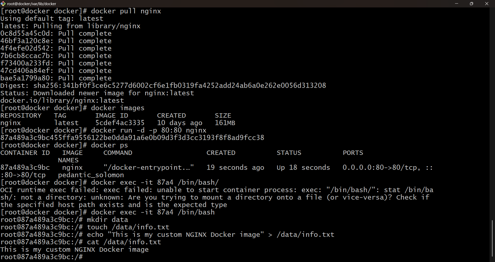
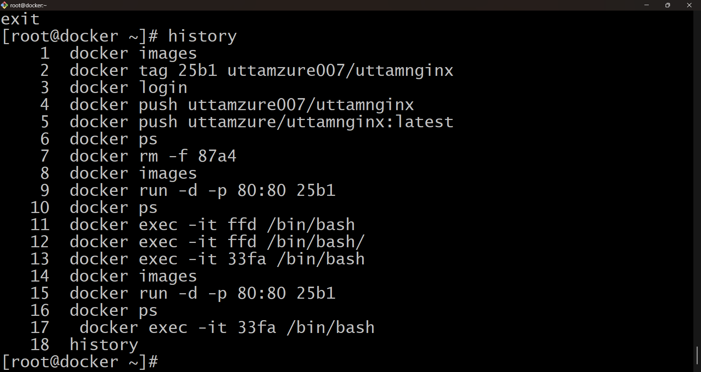
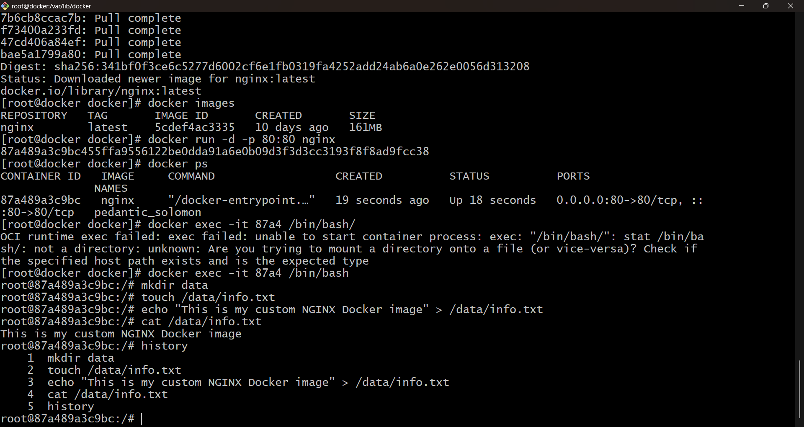
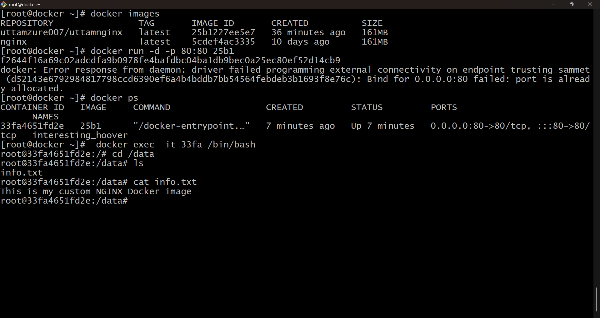
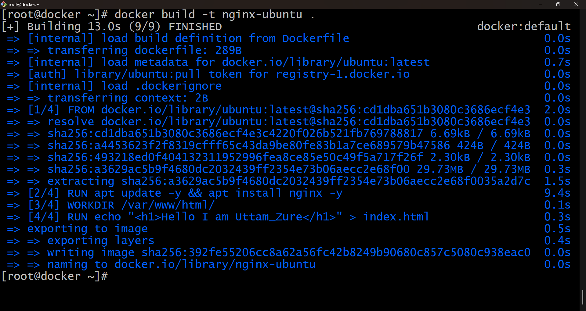
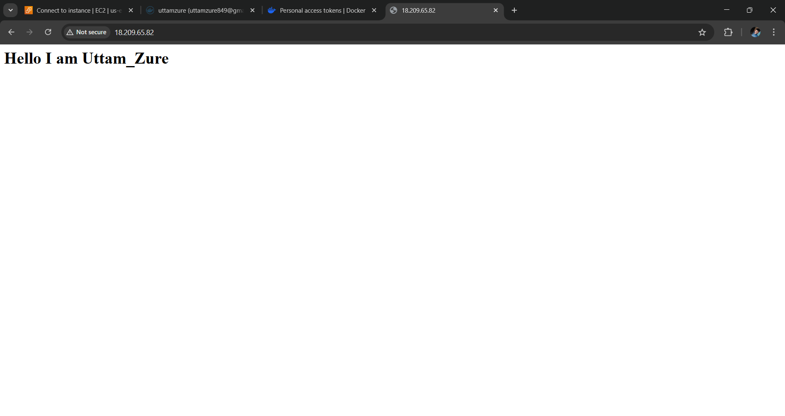
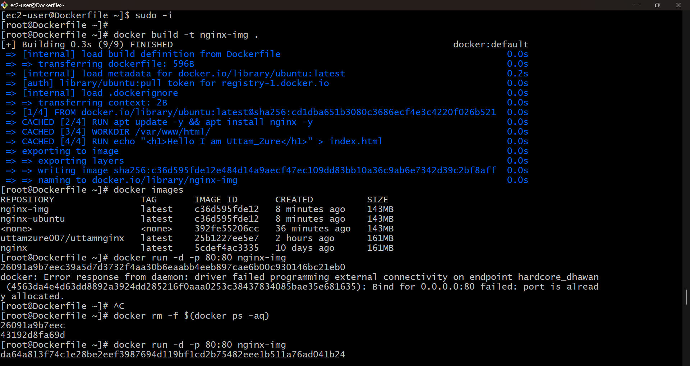
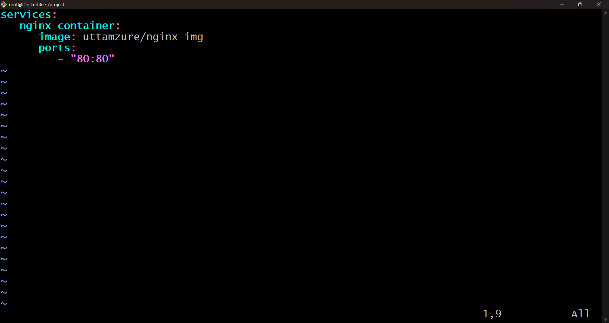
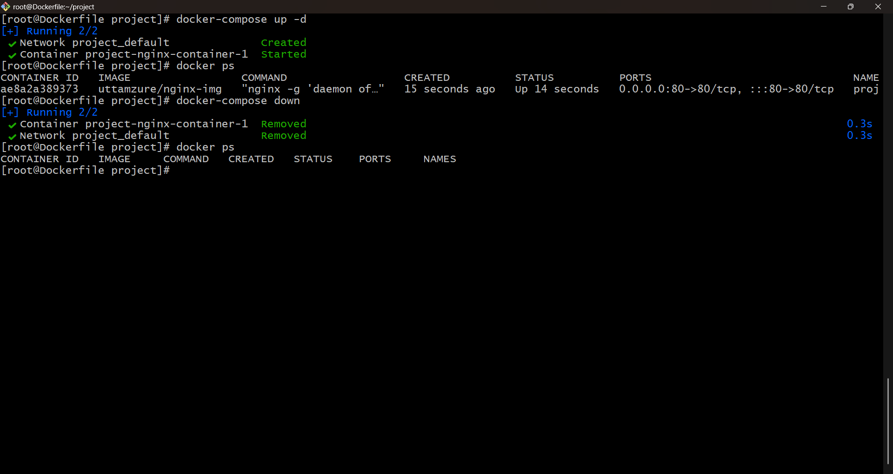
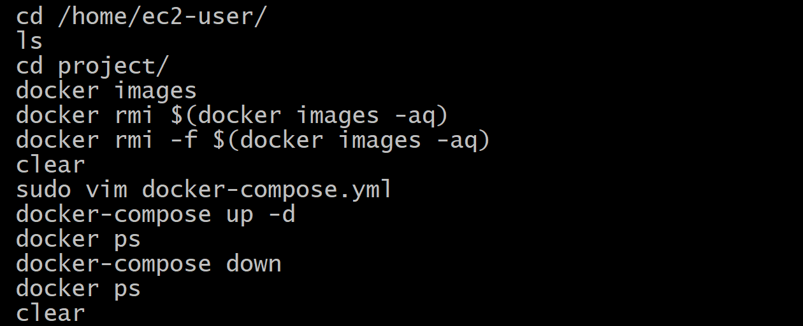

# Part 1: Practical-Based MCQs (Intermediate Level)

## MCQ 1

### You pull an image from Docker Hub and create a container. After stopping thecontainer, you start it again and notice the data inside the container is stillavailable.

What is the correct reason?

A. Docker permanently stores container data

B. The container was restarted, not recreated

C. Docker images automatically save data

D. Docker volumes are enabled by default
## Ans:-B. The container was restarted, not recreated


## MCQ 2
### You run a container in detached mode and map a port, but the application is notaccessible in the browser.

Which is the most likely reason?

A. The container is not running

B. The application inside the container is listening on a different port

C. Port mapping is not supported in Docker

D. Docker Hub is unreachable
## Ans:-B. The application inside the container is listening on a different port

## MCQ 3
### You delete a container, but the image used to create it still exists locally.

Why does this happen?

A. Docker recreates images automatically

B. Images and containers are separate entities

C. Images are system files

D. Docker protects all images
## Ans:-B. Images and containers are separate entities

## MCQ 4
### You modify a file inside a running container. After creating a new container fromthe same image, the changes are missing.

What is the correct explanation?

A. Docker resets containers on restart

B. Containers do not save data by default

C. Image was not rebuilt

D. File permissions were lost
## Ans:-C. Image was not rebuilt

## MCQ 5
### You want to monitor CPU and memory usage of running containers.

Which Docker feature should you use?

A. Docker logs

B. Docker inspect

C. Docker stats

D. Docker exec
## Ans:-C. Docker stats

## MCQ 6
### You try to delete a Docker image but get an error stating it is in use.

What does this mean?

A. The image is corrupted

B. The image is used by a running or stopped container

C. Docker Hub is unavailable

D. Image is locked permanently
## Ans:-B. The image is used by a running or stopped container


## MCQ 7
### Multiple containers are created from the same image. You update one container.

What happens to the other containers?

A. All containers are updated

B. Containers stop automatically

C. Other containers remain unchanged

D. Docker rebuilds all containers
## Ans:-C. Other containers remain unchanged


## MCQ 8
### You commit a running container into a new image.

What will the new image contain?

A. Only the base operating system

B. Only application binaries

C. All filesystem changes made inside the container

D. Only environment variables
## Ans:-C. All filesystem changes made inside the container


## MCQ 9
### You push an image to Docker Hub but cannot see it publicly.

What is the most likely reason?

A. Image push failed

B. Repository is private

C. Docker Hub cache issue

D. Image size exceeded limit
## Ans:-B. Repository is private

## MCQ 10
### After restarting the Docker service, all containers are stopped but still exist.

Why does this happen?

A. Docker deletes containers automatically

B. Containers persist unless explicitly removed

C. Images control container state

D. Docker restores state automatically
## Ans:-B. Containers persist unless explicitly removed


# Part 2: Scenario-Based Practical Questions(Advanced)

Scenario 1: Modify an Existing Image and Publish It
Problem Statement

You are provided with an image available on Docker Hub. Your task is tocustomize this image and publish your own version.

## Tasks to Perform
1.Select and pull any off icial image from Docker Hub.

2.Create a container from the image and run it.

3.Verify the container is running.

4.Access the running container.

5.Inside the container:

- Create a directory.

- Create a file inside that directory.

- Add custom data to the file.

6.Verify the file content.

7.Exit the container without removing it.

8.Create a new image from this container.

9.Tag the image using your Docker Hub username.

10.Log in to Docker Hub via terminal.

11.Push the image to Docker Hub.

12.Remove the local container.

13.Pull the pushed image again.

14.Create a new container from it.

15.Verify that the custom file and data exist.

Answer - 










### Scenario 2: Create an Image From Scratch Using Dockerfile
Problem Statement
You must build a Docker image completely using a Dockerfile.
## Tasks to Perform
1. Create a new project directory.
2. Create a Dockerfile inside the directory
3. In the Dockerfile:
 - Use a base OS image.
 - Install one application or service.
 - Create a directory.
 - Create a file with custom content.
4. Build the image.
5. Verify the image creation.
6. Create and run a container from the image.
7. Access the container and verify:
 -  Application is installed.
 -  File and directory exist.
8. Exit the container.
9. Tag the image properly.
10. Push the image to Docker Hub.
11. Pull the image again and verify functionality.

## **Answer -**

 ### **Create a Dockerfile inside the directory**

```bash
FROM ubuntu:latest
RUN apt update -y && apt install nginx -y
WORKDIR /var/www/html/
RUN touch index.html
RUN echo "<h1>Hello I am Uttam_Zure</h1>" > index.html
EXPOSE 80
CMD ["nginx", "-g", "daemon off;"]

```

```bash
 docker build -t nginx-ubuntu .
```










 
 # Scenario 3: Container Management Using Docker Compose

Problem Statement
 You need to manage containers using Docker Compose.

## Tasks to Perform
1. Create a project directory.
2. Create a docker-compose.yml file.
3. Define at least one service.
4. Use either:
   -  An official image, or
   - Your custom image from Scenario 1 or 2.
5. Configure:
    - Container name
    - Port mapping
6. Start services using Docker Compose.
7. Verify containers are running.
8. Stop the services using Docker Compose.
9. Remove all containers created by Docker Compose.
10. Verify no containers are running

## **Answer -** 

###   **Create a docker-compose.yml file**



### **Run the docker-compose file using below command**

```bash  
docker-compose up -d 
```
### **Stop the docker-compose file using below command**

```bash  
docker-compose down
```



